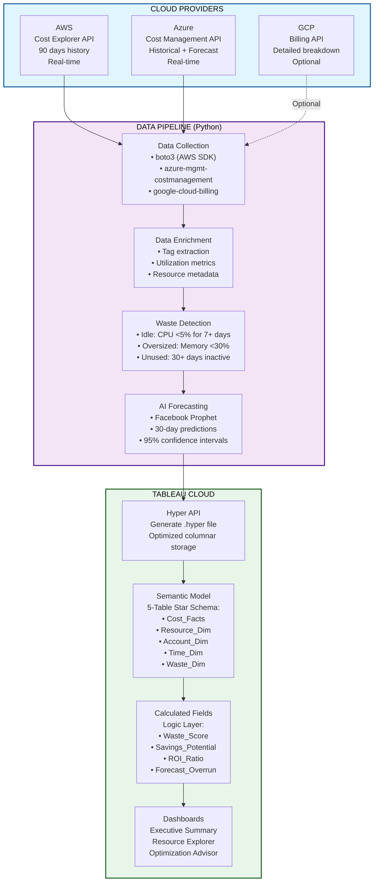
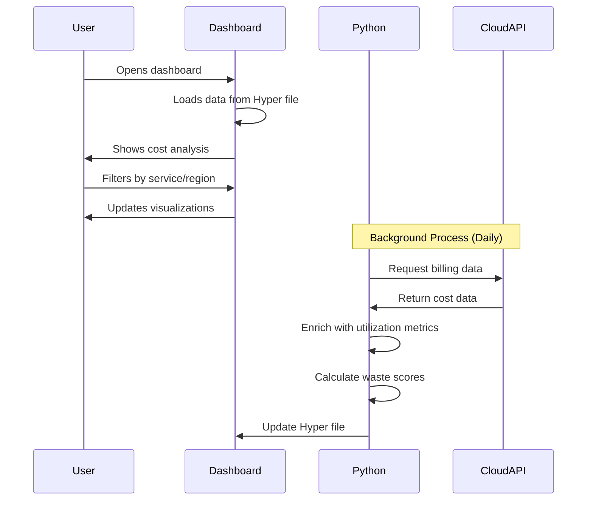
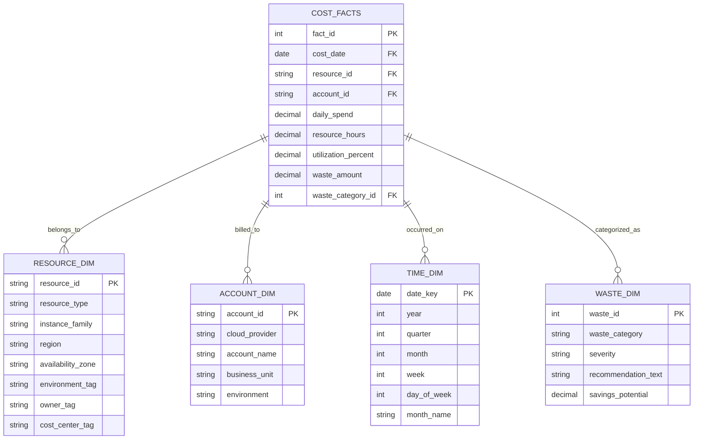

# cloudcost-tracker
**Track and reduce cloud waste across AWS, Azure, and GCP using Tableau analytics.**

<div align="center">

# ☁️ CloudCost Tracker

### *The Zero-Waste Cloud Optimizer*

[](https://aws.amazon.com/)
[](https://azure.microsoft.com/)
[](https://cloud.google.com/)

</div>

---

## Overview

Cloud Cost Tracker is a data analytics solution that helps organizations identify and eliminate wasteful cloud spending. Built with Python for data collection and Tableau for visualization, it provides actionable insights to reduce cloud costs by 30-40%.

## Key Capabilities:

- Multi-cloud cost analysis (AWS, Azure, GCP)
- Automated waste detection (idle resources, oversized instances, unused services)
- Cost forecasting using time-series analysis
- Interactive dashboards for different stakeholder groups
- Actionable recommendations with estimated savings

## Problem Statement

Organizations struggle with cloud cost management:

- 30-40% of cloud spending is wasted on idle or underutilized resources
- Manual cost audits require 40+ hours per month
- Limited visibility into cost drivers across multiple cloud providers
- Delayed response time to cost anomalies (weeks vs. days)

## Solution Architecture

### Data Pipeline

- Collection: Python scripts pull billing data from cloud provider APIs
- Processing: Data enrichment with utilization metrics and resource metadata
- Analysis: Waste detection algorithms identify optimization opportunities
- Storage: Data formatted into Tableau Hyper files for fast querying
- Visualization: Interactive dashboards with drill-down capabilities

## System Architecture

### System Architecture Diagram


### DataFlow Sequence


### Semantic Model Details

## Tech Stack -**Tools & APIs**

| Layer | Technology | Purpose |
|-------|-----------|---------|
| **Data Collection** | boto3, azure-mgmt, google-cloud-billing | Multi-cloud API integration |
| **Processing** | Python 3.9+, Pandas, NumPy | Data transformation & enrichment |
| **Storage** | Tableau Hyper API | High-performance data format |
| **Visualization** | Tableau Cloud (Developer License) | Semantic modeling & dashboards |
| **Version Control** | GitHub (Public Repo) | Code repository |
| **Diagrams** | Draw.io, Mermaid.js | Architecture & data model diagrams |


## Key Features

### Executive Summary Dashboard

#### High-level metrics for leadership:

- Total monthly cloud spend and waste amount
- Month-over-month and quarter-over-quarter trends
- Top 3 most wasteful services
- Quick-win optimization opportunities

#### Resource Explorer Dashboard

Detailed drill-down view for technical teams:

- Multi-level analysis: Account → Service → Resource
- Geographic heat map showing waste distribution by region
- Tag-based filtering (environment, owner, cost center)
- Utilization vs. cost analysis

#### Dimension Tables:

- Resource_Dim: resource_id, resource_type, instance_family, region, tags
- Account_Dim: cloud_provider, account_id, account_name, business_unit
- Time_Dim: date, week, month, quarter, year
- Waste_Dim: waste_category, severity, recommendation_text, savings_potential

## Key Calculated Fields:
```
Waste_Score = (Idle_Hours / Total_Hours) × Daily_Cost
Savings_Potential = SUM(IF Utilization < 10% THEN Cost END)
ROI_Ratio = Potential_Savings / Current_Spend
```

##  Installation & Setup

### **Prerequisites**
- Python 3.9 or higher
- Tableau Cloud developer account
- AWS/Azure/GCP accounts with billing API access

### **1. Clone the Repository**
```bash
git clone https://github.com/SuchithraChandrasekaran/cloudcost-tracker.git
cd cloudcost-tracker
```

### **2. Set Up Python Environment**
```bash
python -m venv venv
source venv/bin/activate  # On Windows: venv\Scripts\activate
pip install -r requirements.txt
```

### **3. Configure Cloud Credentials**

**AWS:**
```bash
aws configure
# Enter   AWS Access Key ID
# Enter   AWS Secret Access Key
# Default region: us-east-1
```

**Azure:**
```bash
az login
az account set --subscription "SUBSCRIPTION_ID"
```

**GCP:**
```bash
gcloud auth application-default login
export GOOGLE_APPLICATION_CREDENTIALS="path/to/service-account-key.json"
```

### **4. Run Data Collection Pipeline**
```bash
python scripts/collect_aws_costs.py
python scripts/collect_azure_costs.py
python scripts/collect_gcp_costs.py
python scripts/merge_and_enrich.py
```

### **5. Generate Tableau Hyper File**
```bash
python scripts/create_hyper_file.py
# Output: cloudcost_data.hyper
```

### **6. Upload to Tableau Cloud**
1. Log in to Tableau Cloud
2. Navigate to **Explore** → **New** → **Data Source**
3. Upload `cloudcost_data.hyper`
4. Configure semantic relationships (see [docs/semantic-model.md](docs/semantic-model.md))

### **7. Import Dashboards**
```bash
# Import pre-built workbooks
tableau import cloudcost.twbx
```
---
## Project Structure
```
cloud-cost-tracker/
├── scripts/
│   ├── collect_aws_costs.py      # AWS Cost Explorer API integration
│   ├── collect_azure_costs.py    # Azure Cost Management API
│   ├── collect_gcp_costs.py      # GCP Billing API integration
│   └── combine_clouds.py         # Multi-cloud data consolidation
├── dashboards/
│   ├── executive_summary.twb     # Leadership dashboard
│   ├── resource_explorer.twb     # Technical deep-dive dashboard
│   └── optimization_advisor.twb  # Recommendations dashboard
├── data/
│   └── cloudcost_data.hyper      # Tableau data extract
├── docs/
│   ├── Calculations.md           # Calculated field definitions
│   ├── DATA_MODEL.md             # Data model documentation
│   ├── WASTE_RULES_AWS.md        # AWS-specific waste detection rules
│   └── PITCH.md                  # Project pitch deck
├── requirements.txt
├── LICENSE
└── README.md
```
## Waste Detection Rules
### Idle Resources:

- CPU utilization below 5% for 7+ consecutive days
- Network traffic below 1 MB/day for 7+ days
- No active connections for 14+ days

### Oversized Instances:

- Memory utilization below 30% consistently
- CPU utilization below 20% with oversized instance type
- Storage volumes with less than 50% utilization

### Unused Resources:

- Unattached EBS volumes (30+ days)
- Elastic IPs without associated instances
- Load balancers with no active targets

## Expected Outcomes
### Cost Reduction:

- Average 30-35% reduction in cloud waste
- Typical savings of $500K+ annually for mid-size companies

### Time Savings:

- Reduce manual audit time from 40 hours/month to 2 hours/month
- Enable same-day response to cost anomalies (vs. 2-3 weeks previously)

### Visibility Improvements:

- Real-time cost tracking vs. quarterly reviews
- Multi-cloud view in single dashboard
- Granular drill-down to individual resources

### Documentation

#### Detailed documentation available in the docs/ directory:

- Calculations.md: Definitions of all calculated fields
- DATA_MODEL.md: Complete data model specifications
- WASTE_RULES_AWS.md: AWS waste detection algorithms
- PITCH.md: Project overview and business case
