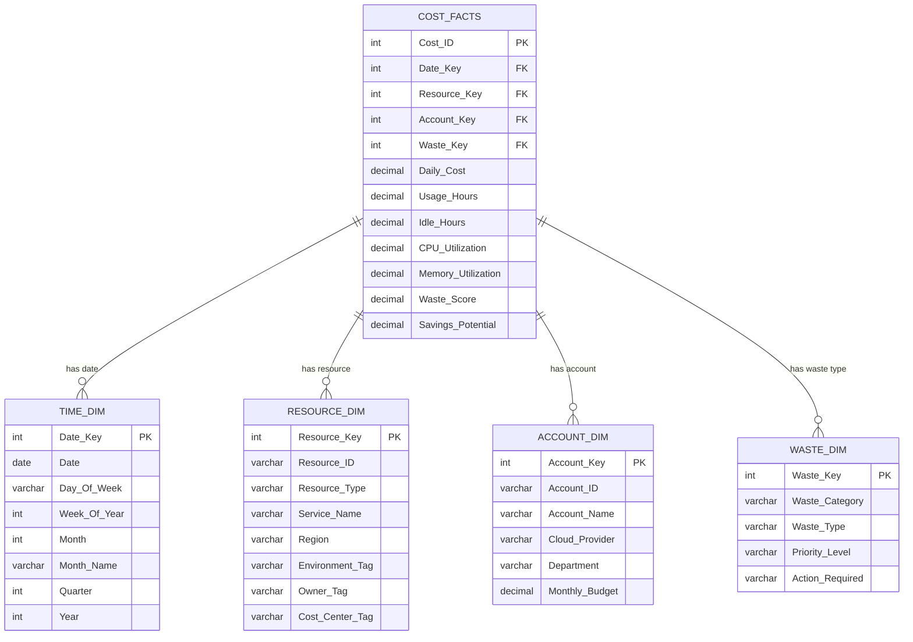

# CloudCost Sentinel - Data Model Documentation

## Overview
This document defines the complete semantic data model for CloudCost Sentinel, including the Entity Relationship Diagram (ERD) and detailed data dictionary. The model uses a **Star Schema** design pattern with one central fact table surrounded by four dimension tables.

---

## Entity Relationship Diagram



---

## Tables Summary

| Table Name | Type | Purpose | Row Count (Estimate) |
|------------|------|---------|---------------------|
| Cost_Facts | Fact | Stores daily cost metrics and waste scores | ~8,000 (90 days × ~90 resources) |
| Resource_Dim | Dimension | Describes cloud resources | ~100 |
| Account_Dim | Dimension | Describes cloud accounts/subscriptions | ~5 |
| Time_Dim | Dimension | Date dimension for time-based analysis | 90 (90 days) |
| Waste_Dim | Dimension | Waste classification categories | ~10 |

---

## Detailed Table Definitions

### 1. Cost_Facts (Fact Table)

**Purpose:** Central fact table containing daily cost measurements and waste metrics for each resource.

**Grain:** One row per resource per day

| Column Name | Data Type | Key Type | Description | Example |
|-------------|-----------|----------|-------------|---------|
| Cost_ID | INT | PK | Unique identifier for each cost record | 10001 |
| Date_Key | INT | FK | Foreign key to Time_Dim | 20241115 |
| Resource_Key | INT | FK | Foreign key to Resource_Dim | 501 |
| Account_Key | INT | FK | Foreign key to Account_Dim | 201 |
| Waste_Key | INT | FK | Foreign key to Waste_Dim | 301 |
| Daily_Cost | DECIMAL(10,2) | - | Cost incurred on this day (USD) | 24.50 |
| Usage_Hours | DECIMAL(5,2) | - | Total hours resource was running | 24.00 |
| Idle_Hours | DECIMAL(5,2) | - | Hours with <5% CPU utilization | 18.50 |
| CPU_Utilization | DECIMAL(5,2) | - | Average CPU utilization (%) | 3.20 |
| Memory_Utilization | DECIMAL(5,2) | - | Average memory utilization (%) | 22.00 |
| Waste_Score | DECIMAL(5,2) | - | Calculated waste score (0-100) | 76.50 |
| Savings_Potential | DECIMAL(10,2) | - | Estimated monthly savings if optimized (USD) | 735.00 |

**Relationships:**
- Many Cost_Facts → One Time_Dim (via Date_Key)
- Many Cost_Facts → One Resource_Dim (via Resource_Key)
- Many Cost_Facts → One Account_Dim (via Account_Key)
- Many Cost_Facts → One Waste_Dim (via Waste_Key)

---

### 2. Resource_Dim (Dimension Table)

**Purpose:** Describes individual cloud resources (EC2, Lambda, S3, etc.)

**Grain:** One row per unique resource

| Column Name | Data Type | Key Type | Description | Example |
|-------------|-----------|----------|-------------|---------|
| Resource_Key | INT | PK | Unique identifier for each resource | 501 |
| Resource_ID | VARCHAR(100) | - | Cloud provider's resource identifier | i-0abc123def456789 |
| Resource_Type | VARCHAR(50) | - | Type of resource | EC2 Instance |
| Service_Name | VARCHAR(50) | - | Cloud service name | EC2 |
| Region | VARCHAR(30) | - | Geographic region | us-east-1 |
| Environment_Tag | VARCHAR(30) | - | Environment tag (dev/staging/prod) | production |
| Owner_Tag | VARCHAR(50) | - | Resource owner email/name | [email protected] |
| Cost_Center_Tag | VARCHAR(50) | - | Cost center or department code | ENG-DATA-001 |

**Common Resource Types:**
- EC2 Instance, Lambda Function, S3 Bucket, RDS Database
- Azure VM, Azure Storage Account

---

### 3. Account_Dim (Dimension Table)

**Purpose:** Describes cloud accounts and subscriptions

**Grain:** One row per cloud account

| Column Name | Data Type | Key Type | Description | Example |
|-------------|-----------|----------|-------------|---------|
| Account_Key | INT | PK | Unique identifier for each account | 201 |
| Account_ID | VARCHAR(50) | - | Cloud provider's account ID | 123456789012 |
| Account_Name | VARCHAR(100) | - | Friendly account name | Production-AWS |
| Cloud_Provider | VARCHAR(20) | - | Cloud provider name (AWS/Azure) | AWS |
| Department | VARCHAR(50) | - | Department owning this account | Engineering |
| Monthly_Budget | DECIMAL(10,2) | - | Allocated monthly budget (USD) | 50000.00 |

---

### 4. Time_Dim (Dimension Table)

**Purpose:** Date dimension for time-based analysis and trends

**Grain:** One row per day

| Column Name | Data Type | Key Type | Description | Example |
|-------------|-----------|----------|-------------|---------|
| Date_Key | INT | PK | Unique date identifier (YYYYMMDD format) | 20241115 |
| Date | DATE | - | Actual date | 2024-11-15 |
| Day_Of_Week | VARCHAR(10) | - | Day name | Friday |
| Week_Of_Year | INT | - | ISO week number | 46 |
| Month | INT | - | Month number (1-12) | 11 |
| Month_Name | VARCHAR(10) | - | Month name | November |
| Quarter | INT | - | Quarter number (1-4) | 4 |
| Year | INT | - | Year | 2024 |

**Date Range:** Last 90 days from current date

---

### 5. Waste_Dim (Dimension Table)

**Purpose:** Classifies types of cloud waste and recommended actions

**Grain:** One row per waste classification type

| Column Name | Data Type | Key Type | Description | Example |
|-------------|-----------|----------|-------------|---------|
| Waste_Key | INT | PK | Unique identifier for waste category | 301 |
| Waste_Category | VARCHAR(30) | - | High-level waste category | Critical |
| Waste_Type | VARCHAR(30) | - | Specific waste pattern | Idle Resource |
| Priority_Level | VARCHAR(20) | - | Action priority | High |
| Action_Required | VARCHAR(100) | - | Recommended action | Stop instance or resize to smaller type |

**Waste Categories:**
- **Critical** (Waste_Score > 80): Immediate action needed
- **High** (Waste_Score 50-80): Action within 1 week
- **Medium** (Waste_Score 20-50): Monitor and optimize
- **Low** (Waste_Score < 20): Acceptable usage

**Waste Types:**
- **Idle Resource**: CPU <5% for 7+ days
- **Oversized Resource**: Memory utilization <30%
- **Unused Storage**: Not accessed in 30+ days
- **Unattached Volume**: EBS volume not attached to instance
- **Legacy Resource**: Old instance types with better alternatives

---

## Design Rationale

### Why Star Schema?

1. **Performance:** Optimized for analytical queries (fast aggregations)
2. **Simplicity:** Easy for business users to understand
3. **Flexibility:** Can slice/dice data by any dimension
4. **Tableau-Friendly:** Tableau works best with Star/Snowflake schemas

### Why These Tables?

- **TIME_DIM:** Enables trend analysis (90-day waste trends, month-over-month comparisons)
- **RESOURCE_DIM:** Enables drill-down (Account → Service → Resource)
- **ACCOUNT_DIM:** Enables multi-cloud comparison (AWS vs Azure)
- **WASTE_DIM:** Enables waste categorization (Critical/High/Medium priority)

---

## Calculated Fields (Tableau)

These fields will be created in Tableau using the above data:

### Waste_Score_Calc
```
Formula: SUM([Idle_Hours]) / SUM([Usage_Hours]) * 100
Description: Percentage of time resource was idle
```

### Savings_Potential_Calc
```
Formula: SUM(IF [Waste_Score] > 50 THEN [Daily_Cost] * 30 END)
Description: Monthly savings if high-waste resources are optimized
```

### ROI_Ratio
```
Formula: [Savings_Potential] / [Total_Spend]
Description: Percentage of total spend that is waste
```

### Budget_Variance
```
Formula: SUM([Daily_Cost] * 30) - [Monthly_Budget]
Description: Amount over/under monthly budget
```

---

## Data Refresh Schedule

| Process | Frequency | Duration |
|---------|-----------|----------|
| AWS Cost Explorer API pull | Daily at 11:00 PM EST | ~5 min |
| Azure Cost Management API pull | Daily at 11:15 PM EST | ~5 min |
| Waste detection calculation | Daily at 11:30 PM EST | ~2 min |
| Hyper file generation | Daily at 11:35 PM EST | ~3 min |
| Tableau Cloud upload | Daily at 11:40 PM EST | ~2 min |

**Total refresh time:** ~17 minutes

---

## Data Sources

### AWS Cost Explorer API
- **Endpoint:** `https://ce.us-east-1.amazonaws.com/`
- **Authentication:** IAM credentials (boto3)
- **Rate Limit:** 4 requests/second
- **Data Retention:** 13 months

### Azure Cost Management API
- **Endpoint:** `https://management.azure.com/`
- **Authentication:** Service Principal
- **Rate Limit:** 30 requests/minute
- **Data Retention:** 13 months

---

## Sample Queries

### Total waste by cloud provider
```sql
SELECT 
    a.Cloud_Provider,
    SUM(c.Savings_Potential) as Total_Waste
FROM Cost_Facts c
JOIN Account_Dim a ON c.Account_Key = a.Account_Key
GROUP BY a.Cloud_Provider
```

### Top 10 most wasteful resources
```sql
SELECT 
    r.Resource_ID,
    r.Service_Name,
    SUM(c.Waste_Score) as Total_Waste_Score,
    SUM(c.Savings_Potential) as Total_Savings
FROM Cost_Facts c
JOIN Resource_Dim r ON c.Resource_Key = r.Resource_Key
GROUP BY r.Resource_ID, r.Service_Name
ORDER BY Total_Waste_Score DESC
LIMIT 10
```

### Monthly trend
```sql
SELECT 
    t.Month_Name,
    SUM(c.Daily_Cost) as Total_Spend,
    SUM(c.Savings_Potential) as Total_Waste
FROM Cost_Facts c
JOIN Time_Dim t ON c.Date_Key = t.Date_Key
GROUP BY t.Month_Name
ORDER BY t.Month
```

---

## Implementation Notes

1. **Always use surrogate keys** (Resource_Key, Account_Key, etc.) instead of natural keys for joins
2. **Date_Key format:** Use YYYYMMDD integer format (e.g., 20241115) for faster joins than DATE type
3. **Waste_Score calculation:** Pre-calculated in Python before Hyper file generation
4. **Missing data:** Use NULL for missing tags, 0 for missing metrics
5. **Data types:** Keep consistent between Python (pandas), Hyper API, and Tableau

---
