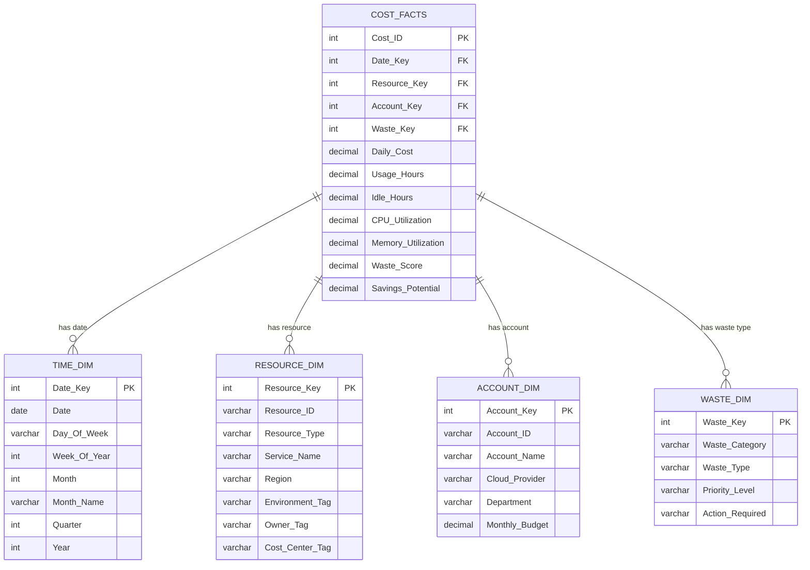

# CloudCost Sentinel - Entity Relationship Diagram (ERD)

## Star Schema Design

This data model uses a **Star Schema** pattern with one central fact table (COST_FACTS) connected to four dimension tables.

---

## Entity Relationship Diagram



---

## Table Descriptions

### COST_FACTS (Fact Table)
**Purpose:** Central fact table containing daily cost measurements and waste metrics.

**Grain:** One row per resource per day

**Key Metrics:**
- Daily_Cost: Cost incurred on this day (USD)
- Waste_Score: Calculated waste score (0-100)
- Savings_Potential: Estimated monthly savings if optimized

---

### TIME_DIM (Dimension Table)
**Purpose:** Date dimension for time-based analysis.

**Grain:** One row per day (90 days)

**Key Attributes:**
- Date_Key: Unique identifier (YYYYMMDD format)
- Month_Name, Quarter, Year: For grouping and filtering

---

### RESOURCE_DIM (Dimension Table)
**Purpose:** Describes individual cloud resources.

**Grain:** One row per unique resource (~100 resources)

**Key Attributes:**
- Resource_ID: Cloud provider's resource identifier (e.g., i-0abc123)
- Service_Name: EC2, Lambda, S3, RDS, etc.
- Tags: Environment, Owner, Cost_Center for filtering

---

### ACCOUNT_DIM (Dimension Table)
**Purpose:** Describes cloud accounts and subscriptions.

**Grain:** One row per cloud account (~5 accounts)

**Key Attributes:**
- Cloud_Provider: AWS or Azure
- Monthly_Budget: Allocated budget for variance analysis

---

### WASTE_DIM (Dimension Table)
**Purpose:** Classifies types of cloud waste.

**Grain:** One row per waste classification type (~10 types)

**Key Attributes:**
- Waste_Category: Critical, High, Medium, Low
- Waste_Type: Idle Resource, Oversized Resource, Unused Storage
- Action_Required: Recommended optimization action

---

## Relationships

All relationships follow the **Star Schema** pattern (Many-to-One from Fact to Dimensions):

| From Table | To Table | Cardinality | Foreign Key |
|------------|----------|-------------|-------------|
| COST_FACTS | TIME_DIM | Many-to-One | Date_Key |
| COST_FACTS | RESOURCE_DIM | Many-to-One | Resource_Key |
| COST_FACTS | ACCOUNT_DIM | Many-to-One | Account_Key |
| COST_FACTS | WASTE_DIM | Many-to-One | Waste_Key |

---

## Design Rationale

### Why Star Schema?

1. **Performance:** Optimized for analytical queries (fast aggregations)
2. **Simplicity:** Easy for business users to understand
3. **Flexibility:** Can slice/dice data by any dimension
4. **Tableau-Friendly:** Tableau works best with Star/Snowflake schemas

### Why These Tables?

- **TIME_DIM:** Enables trend analysis (90-day waste trends, month-over-month comparisons)
- **RESOURCE_DIM:** Enables drill-down (Account → Service → Resource)
- **ACCOUNT_DIM:** Enables multi-cloud comparison (AWS vs Azure)
- **WASTE_DIM:** Enables waste categorization (Critical/High/Medium priority)

---

## Example Queries

### Total waste by cloud provider
```sql
SELECT 
    a.Cloud_Provider,
    SUM(c.Savings_Potential) as Total_Waste
FROM COST_FACTS c
JOIN ACCOUNT_DIM a ON c.Account_Key = a.Account_Key
GROUP BY a.Cloud_Provider
```

### Top 10 most wasteful resources
```sql
SELECT 
    r.Resource_ID,
    r.Service_Name,
    AVG(c.Waste_Score) as Avg_Waste_Score,
    SUM(c.Savings_Potential) as Total_Savings
FROM COST_FACTS c
JOIN RESOURCE_DIM r ON c.Resource_Key = r.Resource_Key
GROUP BY r.Resource_ID, r.Service_Name
ORDER BY Total_Savings DESC
LIMIT 10
```

### Monthly trend
```sql
SELECT 
    t.Month_Name,
    SUM(c.Daily_Cost) as Total_Spend,
    SUM(c.Savings_Potential) as Total_Waste,
    (SUM(c.Savings_Potential) / SUM(c.Daily_Cost)) * 100 as Waste_Percentage
FROM COST_FACTS c
JOIN TIME_DIM t ON c.Date_Key = t.Date_Key
GROUP BY t.Month_Name, t.Month
ORDER BY t.Month
```

---

## Implementation Notes

1. **Surrogate Keys:** Use integer surrogate keys (Resource_Key, Account_Key) instead of natural keys for better performance
2. **Date_Key Format:** YYYYMMDD integer (e.g., 20241115) for faster joins than DATE type
3. **Pre-Aggregation:** Waste_Score calculated in Python before Hyper file generation
4. **Data Types:** Match types between Python (pandas), Hyper API, and Tableau

---

## Related Documentation

- [Data Dictionary](DATA_DICTIONARY.md) - Detailed column definitions
- [Architecture Diagram](ARCHITECTURE.md) - Overall system design

---
